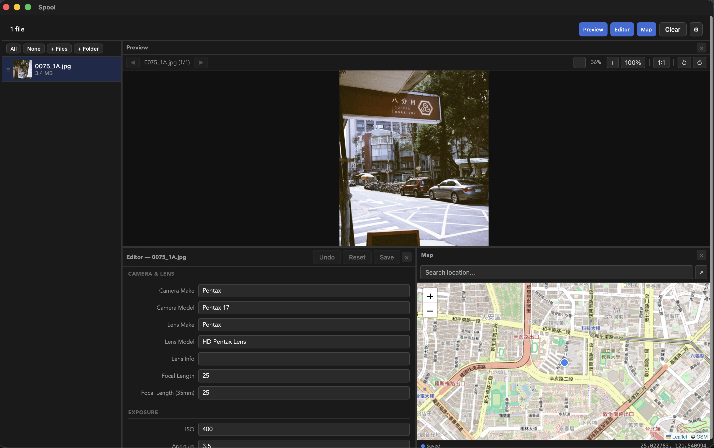
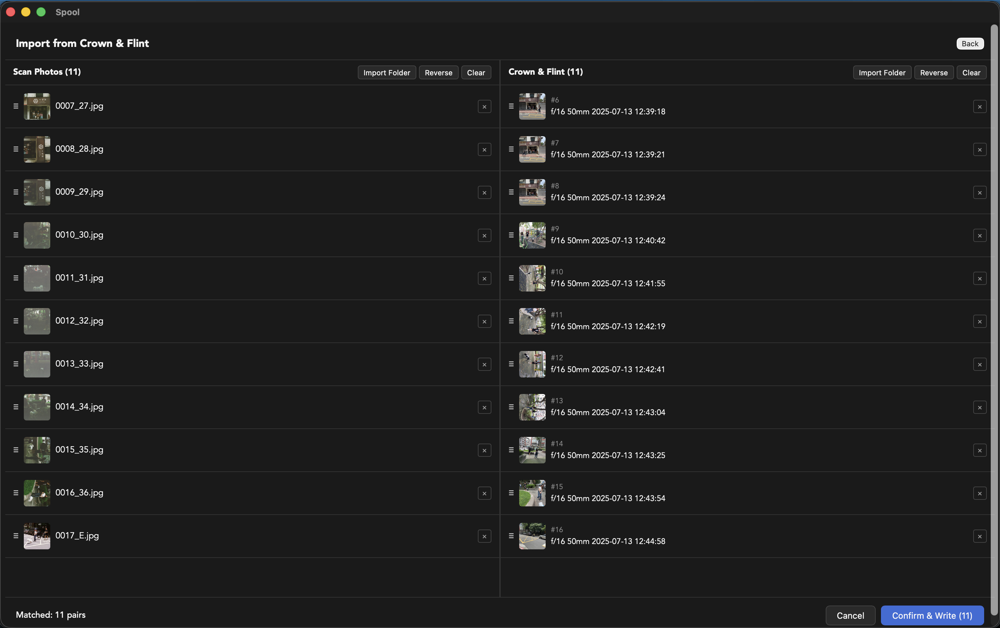
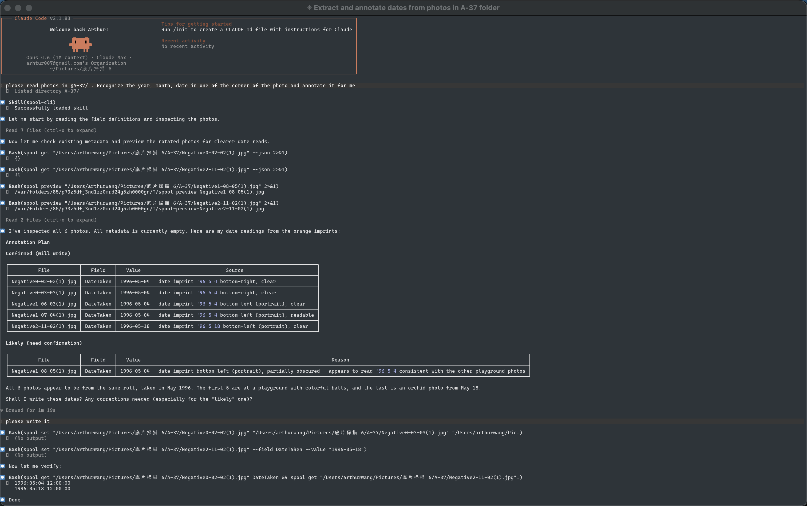

# Spool

Photo metadata toolkit for film photographers — desktop app, CLI, and AI-powered annotation.

Built with Rust (Tauri) + Svelte + OpenStreetMap.



## Features

### Desktop App
- **Unified metadata editing** — EXIF, XMP, and IPTC in one interface, auto-synced on write
- **Built for film photographers** — fill in camera, lens, exposure, GPS for scanned photos from scratch
- **Crown & Flint import** — visually align scan photos with C&F app data, one-click metadata write
- **GPS coordinate picker** — OpenStreetMap + Leaflet embedded map with location search
- **Photo preview** — quick (2048px) and 1:1 full resolution with zoom, pan, rotate
- **Multi-select & batch edit** — Cmd+click, Shift+click, per-field dirty tracking
- **RAW format support** — CR2, CR3, NEF, ARW, RAF, DNG, ORF, RW2, PEF
- **Custom metadata fields** — user-defined fields stored in XMP (spool: namespace)
- **Rating & keywords** — star rating, keywords, location fields
- **Light / Dark / System theme**
- **Cross-platform** — Windows, Linux, macOS

### CLI
- **Read & write metadata from the terminal** — same engine as the desktop app
- **Batch operations** — set the same fields across multiple files in one command
- **JSON output** — pipe into scripts or other tools

### AI-Assisted Annotation (Claude Code Skill)
- **Visual date reading** — recognizes date imprints on film scans
- **Place name to GPS** — resolves locations to coordinates automatically
- **Confidence classification** — sorts findings as confirmed / likely / uncertain before writing
- **Batch workflow** — annotate an entire roll in one conversation

## Crown & Flint Import

Import metadata from the [Crown & Flint](https://crownandflint.com) film photography app. Visually align your scanned photos with C&F's recorded exposure data, then write everything in one click.



## CLI

Spool includes a standalone CLI for reading and writing photo metadata from the terminal. It shares the same metadata engine as the GUI app.

<!-- TODO: Screenshot — terminal showing `spool get` output on a photo with populated metadata fields -->

```
spool list <directory> [--recursive]
spool get <file> [field] [--json]
spool set <file>... --field <field> --value <value>
spool set <file>... --json '{"Field":"value",...}'
spool preview <file> [--rotate <90|180|270>]
```

### Examples

```bash
# Read all metadata from a photo
spool get IMG_001.jpg

# Set date and camera info for a batch of scans
spool set IMG_001.jpg IMG_002.jpg IMG_003.jpg --json \
  '{"CameraMake":"Nikon","CameraModel":"FM2","ISO":"400","DateTaken":"2024-12-25"}'

# Set GPS coordinates
spool set IMG_001.jpg --json \
  '{"GPSLatitude":"25.0340","GPSLongitude":"121.5645","GPSLatitudeRef":"N","GPSLongitudeRef":"E"}'

# Preview a rotated scan
spool preview IMG_001.jpg --rotate 90
```

The CLI is bundled inside the app — no separate install needed:
- **macOS**: `/Applications/Spool.app/Contents/MacOS/spool`
- **Linux**: `/usr/bin/spool` (deb)

Or install standalone from [GitHub Releases](https://github.com/WanliSha/Spool/releases).

## AI-Assisted Annotation

Spool ships with a [Claude Code](https://claude.com/claude-code) skill that lets Claude read your film photos, recognize date imprints, resolve place names to GPS coordinates, and batch-write metadata — all through natural conversation.



```
You: Annotate these film scans with dates and GPS — they were taken at Taipei 101.

Claude: [reads each photo, spots date stamps]

  ## Annotation Plan

  ✓ Confirmed
  IMG_001-003  | GPSLatitude   | 25.0340    | "Taipei 101"
  IMG_001.jpg  | DateTaken     | 2024-12-25 | date imprint (clear)

  ? Likely
  IMG_003.jpg  | DateTaken     | 2024-12-25 | imprint faded, best guess

  OK to write the confirmed ones? And confirm the likely ones?
```

The skill follows a structured SOP:
1. **Gather** — read photos, check existing metadata, collect user input
2. **Classify** — sort each field as confirmed / likely / uncertain
3. **Present** — show annotation plan with sources and confidence
4. **Confirm** — write confirmed, ask about the rest
5. **Write** — batch execute via CLI
6. **Verify** — spot-check results
7. **Organize** — optionally sort files into folders by date, camera, or location

### Setup

The skill is at `.claude/skills/spool-cli/` in this repo. Copy it to `~/.claude/skills/spool-cli/` to use it globally, then open Claude Code and mention your photos — the skill triggers automatically.

## Installation

### macOS (Homebrew)
```
brew tap WanliSha/spool
brew install --cask spool
```

### Download
Download the latest release from [GitHub Releases](https://github.com/WanliSha/Spool/releases).

## License

Spool is dual-licensed:

- **Open Source**: [GPLv3](./LICENSE)
- **Commercial**: For closed-source or proprietary use, see [Commercial License](./LICENSE-COMMERCIAL.md)
